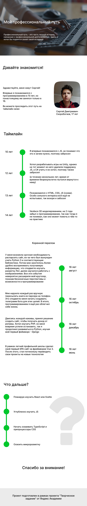

##  Общее устройство проекта и аргументация в выборе способа реализации
### Структура проекта
1) В корневой директории находятся файлы: index.html, README.md, .gitignore, desktop_1.png и директории: css и img
2) В директории css находится файл стилей
3) В директории img находятся используемые в index.html изображения

### Выбор способа реализации
1) Так как проект предполагал наличие только одной страницы, принял решение не использовать JS фреймворки, увеличивающие своим наличием время ло первого байта и время первой отрисовки
2) Из-за относительной простоты, не делил файл css, что способствовало лучшей скорости его загрузки

### Используемые технологии
1) Технологии гипертекстовой разметки HTML 5
2) Каскадную таблицу стилей CSS
3) Систему контроля версий GIT

### Вспомогательные инструменты
1) Linux дистрибутив Ubuntu 22.04.1 LTS
2) Интернет обозреватель Yandex Browser (beta)
3) Инструменты разработчика DevTools
4) Интегрированная среда разработки WebStorm

### Ход работы
1) Создал макет сайта в программе figma
2) На его основе сверстал сайт
3) Залил на GitHub

### Макет прилагается
